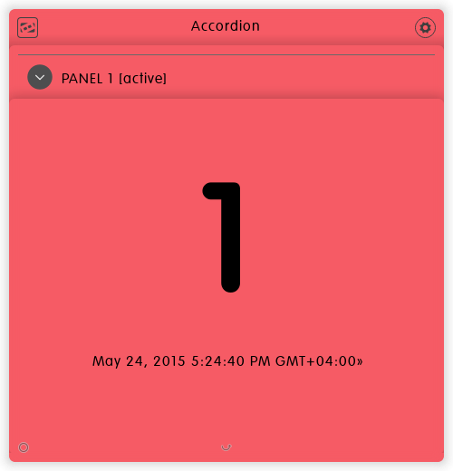

Accordion Dizmo
===============

[](https://gitter.im/dizmo/accordion?utm_source=badge&utm_medium=badge&utm_campaign=pr-badge&utm_content=badge)

The Accordion dizmo demonstrates how easy it is to use the accordion feature
of dizmoElements. Let's have a look at a screen shot:


As you see the panel `#1` of the accordion has been activated. If we click on
the round header icon in the top left corner, it will close with a nice
animation and you will see all listed accordion panels:


By clicking on the round icon or the header text of panel `#1` you can reopen
it. Further, as you see since the list is longer than the available dizmo space
a corresponding scrollbar has been displayed on the right hand side: By simply
dragging the list you can move the content up or down.

Structure: HTML
---------------

```html
<div class='dizmo-accordion no-dizmo-drag' data-type='dizmo-accordion'>
  <ul class='dizmo-accordion-panels'>

    <!-- listed panels: shown in accordion list -->

    <li class='dizmo-accordion-panel' id='0'>
      <div class='dizmo-accordion-panel-header'>
        <div class='dizmo-accordion-panel-header-content'>
          <span class='dizmo-accordion-panel-header-icon'>&nbsp;</span>
          <span class='dizmo-accordion-panel-header-text'>PANEL 0</span>
        </div>
        <div class='dizmo-accordion-panel-header-content active'>
          <span class='dizmo-accordion-panel-header-icon'>&nbsp;</span>
          <span class='dizmo-accordion-panel-header-text'>PANEL 0 [active]</span>
        </div>
      </div>
      <div class='dizmo-accordion-panel-body'>
        <div class='dizmo-accordion-panel-body-content'>
          <div><span>0</span><p></p></div>
        </div>
      </div>
    </li>

    <li class='dizmo-accordion-panel' id='1' data-state='active'>
      <div class='dizmo-accordion-panel-header'>
        <div class='dizmo-accordion-panel-header-content'>
          <span class='dizmo-accordion-panel-header-icon'>&nbsp;</span>
          <span class='dizmo-accordion-panel-header-text'>PANEL 1</span>
        </div>
        <div class='dizmo-accordion-panel-header-content active'>
          <span class='dizmo-accordion-panel-header-icon'>&nbsp;</span>
          <span class='dizmo-accordion-panel-header-text'>PANEL 1 [active]</span>
        </div>
      </div>
      <div class='dizmo-accordion-panel-body'>
        <div class='dizmo-accordion-panel-body-content'>
          <div><span>1</span><p></p></div>
        </div>
      </div>
    </li>

    <li class='dizmo-accordion-panel'>...</li>

    <li class='dizmo-accordion-panel' id='9'>
      <div class='dizmo-accordion-panel-header'>
        <div class='dizmo-accordion-panel-header-content'>
          <span class='dizmo-accordion-panel-header-icon'>&nbsp;</span>
          <span class='dizmo-accordion-panel-header-text'>PANEL 9</span>
        </div>
        <div class='dizmo-accordion-panel-header-content active'>
          <span class='dizmo-accordion-panel-header-icon'>&nbsp;</span>
          <span
              class='dizmo-accordion-panel-header-text'>PANEL 9 [active]</span>
        </div>
      </div>
      <div class='dizmo-accordion-panel-body'>
        <div class='dizmo-accordion-panel-body-content'>
          <div><span>9</span><p></p></div>
        </div>
      </div>
    </li>

  </ul>
</div>
```

As you see the structure is straight forward: Each panel has a `header` and a
`body`; each `header` has an `active content` and a (passive) `content` where
each header `content` has an `icon` and a `text`. Finally, each `body` has a
`content` which can be filled with a custom payload.

Please note, that panel `#1` has `data-state='active'` causing the panel to be
shown by default: without any such `data-state` set to `active`, by default the
list of all panels is shown instead.

Structure: Unlisted panels
--------------------------

```html
<div class='dizmo-accordion no-dizmo-drag' data-type='dizmo-accordion'>
  <ul class='dizmo-accordion-panels'>

    <!-- listed panels: shown in accordion list -->

    <li class='dizmo-accordion-panel'>...</li>

    <!-- unlisted panels: not shown in accordion list -->

    <li class='dizmo-accordion-panel unlisted' id='a'>
      <div class='dizmo-accordion-panel-header'>
        <div class='dizmo-accordion-panel-header-content active'>
          <span class='dizmo-accordion-panel-header-icon'>&nbsp;</span>
          <span
              class='dizmo-accordion-panel-header-text'>PANEL A [active]</span>
        </div>
      </div>
      <div class='dizmo-accordion-panel-body'>
        <div class='dizmo-accordion-panel-body-content'>
          <div><span>A</span><p></p></div>
        </div>
      </div>
    </li>

    <li class='dizmo-accordion-panel unlisted'>...</li>

    <li class='dizmo-accordion-panel unlisted' id='z'>
      <div class='dizmo-accordion-panel-header'>
        <div class='dizmo-accordion-panel-header-content active'>
          <span class='dizmo-accordion-panel-header-icon'>&nbsp;</span>
          <span class='dizmo-accordion-panel-header-text'>PANEL Z [active]</span>
        </div>
      </div>
      <div class='dizmo-accordion-panel-body'>
        <div class='dizmo-accordion-panel-body-content'>
          <div><span>Z</span><p></p></div>
        </div>
      </div>
    </li>

  </ul>
</div>
```

The accordion further supports panels which are *not* listed in the accordion's
list: therefore, such panels cannot be activated directly from the list; but it
is possible to activate them using the [JavaScript API](#API: JavaScript).

Such *unlisted* panels become handy, to e.g. simulate panel nesting: create a
*listed* panel, put a button in its content area, and wire the `click` event of
the button with an activation of an unlisted panel -- that's it!

The Accordion dizmo uses exactly this mechanism: within each listed panel there
are three unlisted panels `#a`, `#b` and `#c`. By clicking on the timestamp it is
possible to cycle through them.

Styling: (S)CSS
---------------

```css
div.dizmo-accordion {
  ul.dizmo-accordion-panels {
    li.dizmo-accordion-panel {
      .dizmo-accordion-panel-header {
        border-top: 1px solid dimgrey; /* default: none */
      }
      .dizmo-accordion-panel-body {
        height: calc(100% - 20px - 48px); /* alternative: omit --> 100% */
        margin: 0 10px 10px;                      /*      omit --> 0    */
        width: calc(100% - 20px);                 /*      omit --> 100% */
        .dizmo-accordion-panel-body-content {     /*** CUSTOM CONTENT ***/

          display: table;
          div {
            display: table-cell;
            vertical-align: middle;
            text-align: center;
            span {
              font-size: 10em;
              font-weight: bold;
            }
            p:hover {
              text-decoration: underline;
            }
          }
        }
      }
    }
  }
  .iScrollVerticalScrollbar {
    .iScrollIndicator {
      border: 1px solid dimgrey; /* default: library dependent */
    }
  }
}
```

As you see the SCSS hierarchy reflects the HTML, with one exception: namely the
scrollbar `.iScrollVerticalScrollbar`. Actually, it is not required but has been
shown here for demonstration purposes: You could simply omit it, and the
scrollbar would still be rendered properly (albeit with a slightly different
gray shading).

Let's remove the scrollbar style and the body margin -- while keeping the same
`CUSTOM CONTENT` styles:

```css
div.dizmo-accordion {
  ul.dizmo-accordion-panels {
    li.dizmo-accordion-panel {
      .dizmo-accordion-panel-header {
        border-top: 1px dashed dimgrey; /* default: none */
      }
      .dizmo-accordion-panel-body {
        .dizmo-accordion-panel-body-content {     /*** CUSTOM CONTENT ***/

          display: table;
          div {
            display: table-cell;
            vertical-align: middle;
            text-align: center;
            span {
              font-size: 10em;
              font-weight: bold;
            }
            p:hover {
              text-decoration: underline;
            }
          }
        }
      }
    }
  }
}
```

As you see the body margin of the accordion panels has been removed. Since the
list looks almost the same as before, no corresponding screen shot has not is
being shown.



**BTW:** If you wonder where the red color of the accordion has been set, it
has not been! Since no background color has been defined, it is by default 
transparent. Further, since the dizmo itself has a red color (manually set at
the time when the screen shots were taken) the accordion appears also in red.

API: JavaScript
---------------

Toggling, showing and hiding panels is straight forward: Just call on the
dizmoElements object the `daccordion(..)` function with the corresponding
parameters:

To toggle panel `#1` invoke:

```js
DizmoElements('.dizmo-accordion').daccordion('toggle-panel', jQuery('#1'))
```

To show panel `#1` invoke:

```js
DizmoElements('.dizmo-accordion').daccordion('show-panel', jQuery('#1'))
```

To hide panel `#1` invoke:

```js
DizmoElements('.dizmo-accordion').daccordion('hide-panel', jQuery('#1'))
```

The scrollbar of the list is also controllable -- to create the scrollbar invoke:

```js
DizmoElements('.dizmo-accordion').daccordion('scroll-create')
```

To destroy the scrollbar invoke:

```js
DizmoElements('.dizmo-accordion').daccordion('scroll-destroy')
```

To update the scrollbar invoke:

```js
DizmoElements('.dizmo-accordion').daccordion('scroll-update')
```

To update the scrolling of the *content* invoke:

```js
DizmoElements('.dizmo-accordion').daccordion('scroll-update-content')
```

Usually, these three invocations will not be required at all -- but it may make
very much sense upon e.g. resizing the dizmo to destroy the scrollbar when the
resizing operation starts, and then (re-)create it once resizing is done.

API: Events
-----------

The accordion supports four different events: `before-show` and `after-show`
plus `before-hide` and `after-hide`. You can subscribe to them to perform
various tasks: E.g. check permission(s) for a given panel in the `before-show`
event handler; if no authorization has been provided don't show it -- here is a
corresponding code snippet:

```js
$panels.on('before-show', function (ev, do_show) {
    var $target = jQuery(ev.target);
    console.debug('[ON:BEFORE-SHOW]', $target);

    if (this.authorized) do_show($target);
}.bind(this);

$panels.on('after-show', function (ev, do_show) {
    var $target = jQuery(ev.target);
    console.debug('[ON:AFTER-SHOW]', $target);
}.bind(this);


$panels.on('before-hide', function (ev, do_hide) {
    var $target = jQuery(ev.target);
    console.debug('[ON:BEFORE-HIDE]', $target);

    if (this.authorized) do_hide($target);
}.bind(this);

$panels.on('after-hide', function (ev) {
    var $target = jQuery(ev.target);
    console.debug('[ON:AFTER-HIDE]', $target);
}.bind(this);
```

By combining the event handlers with the listed and/or unlisted panels the
accordion allows you to create some very interesting and complex dizmos.
